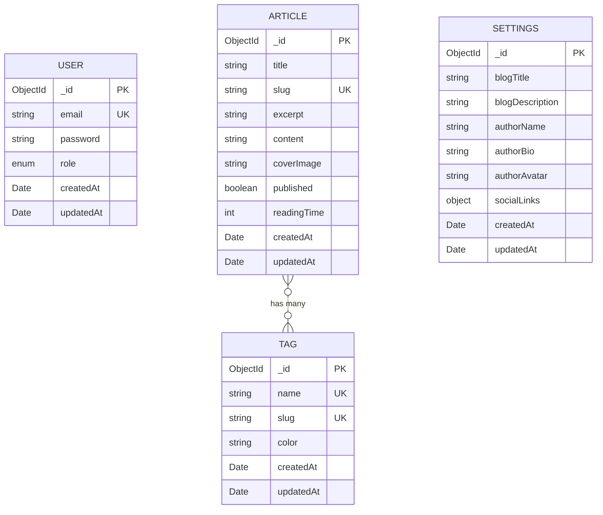

# Database Design - Engineering Chronicle Blog

This document outlines the MongoDB database schema design for the Engineering Chronicle blog backend.

## Overview

The database uses **MongoDB** with **Mongoose** as the ODM. The design follows the API specification defined in `api-specification.yaml`.

---

## Collections

### 1. Users Collection

Stores admin user accounts for authentication and authorization.

```typescript
interface IUser {
  _id: ObjectId;           // MongoDB ObjectId (maps to API's UUID format)
  email: string;           // Unique, required, format: email
  password: string;        // Hashed password, minLength: 8 (before hashing)
  role: 'admin';           // Enum: only 'admin' for now (extendable)
  createdAt: Date;         // Auto-generated timestamp
  updatedAt: Date;         // Auto-updated timestamp
}
```

**Indexes:**
- `email`: unique index for fast lookup and enforcement of uniqueness

**Notes:**
- Password is stored as bcrypt hash
- JWT tokens are stateless; no refresh token collection needed initially
- For logout, consider implementing a token blacklist (optional enhancement)

---

### 2. Articles Collection

Stores blog articles with support for drafts and published states.

```typescript
interface IArticle {
  _id: ObjectId;           // MongoDB ObjectId (maps to API's UUID format)
  title: string;           // Required, maxLength: 200
  slug: string;            // Required, unique, pattern: ^[a-z0-9-]+$
  excerpt: string;         // Required, maxLength: 500
  content: string;         // Required, HTML content from rich text editor
  coverImage: string | null;  // Optional, format: URI
  tags: ObjectId[];        // Array of Tag references, required (can be empty)
  published: boolean;      // Default: false
  readingTime: number;     // Calculated field, in minutes
  createdAt: Date;         // Auto-generated timestamp
  updatedAt: Date;         // Auto-updated timestamp
}
```

**Indexes:**
- `slug`: unique index for URL-based lookup
- `published`: index for filtering published/draft articles
- `tags`: index for tag-based filtering
- `createdAt`: index for sorting (descending for latest first)
- Compound index: `{ published: 1, createdAt: -1 }` for public article queries
- Text index: `{ title: 'text', excerpt: 'text', content: 'text' }` for search

**Virtual Fields:**
- `tagDetails`: Populated tag objects (via Mongoose populate)

**Calculated Fields:**
- `readingTime`: Auto-calculated based on content length (~200 words/minute)

---

### 3. Tags Collection

Stores article tags/categories with color coding.

```typescript
interface ITag {
  _id: ObjectId;           // MongoDB ObjectId (maps to API's UUID format)
  name: string;            // Required, unique, maxLength: 50
  slug: string;            // Required, unique, pattern: ^[a-z0-9-]+$
  color: string;           // Required, pattern: ^#[0-9A-Fa-f]{6}$
  createdAt: Date;         // Auto-generated timestamp
  updatedAt: Date;         // Auto-updated timestamp
}
```

**Indexes:**
- `name`: unique index
- `slug`: unique index for URL-based lookup

**Virtual/Aggregated Fields:**
- `articleCount`: Computed via aggregation (count of articles referencing this tag)

---

### 4. Settings Collection

Stores blog configuration (singleton document pattern).

```typescript
interface ISettings {
  _id: ObjectId;           // MongoDB ObjectId
  blogTitle: string;       // Required, maxLength: 100
  blogDescription: string; // Required, maxLength: 500
  authorName: string;      // Required, maxLength: 100
  authorBio: string;       // Optional, maxLength: 1000
  authorAvatar: string | null;  // Optional, format: URI
  socialLinks: {
    twitter: string | null;   // Optional, format: URI
    github: string | null;    // Optional, format: URI
    linkedin: string | null;  // Optional, format: URI
  };
  createdAt: Date;         // Auto-generated timestamp
  updatedAt: Date;         // Auto-updated timestamp
}
```

**Design Notes:**
- This collection will contain a single document (singleton pattern)
- Use `findOneAndUpdate` with `upsert: true` for updates
- Consider adding a `key` field set to 'main' for the singleton pattern

---

## Entity Relationship Diagram



---

## ID Strategy

The API specification uses UUID format for IDs. MongoDB uses ObjectId by default. We have two options:

### Option A: Use MongoDB ObjectId (Recommended)
- Convert ObjectId to string when sending API responses
- Use Mongoose's `_id` field directly
- More performant and native to MongoDB

### Option B: Use UUID
- Add a separate `uuid` field
- Requires additional unique index
- More compatible with other systems

**Recommendation:** Use Option A with MongoDB ObjectId, converting to string in API responses.

---

## Indexing Strategy

### Primary Indexes
| Collection | Field(s) | Type | Purpose |
|------------|----------|------|---------|
| users | email | unique | Authentication lookup |
| articles | slug | unique | URL-based lookup |
| articles | published, createdAt | compound | Public listing queries |
| articles | title, excerpt, content | text | Full-text search |
| tags | name | unique | Duplicate prevention |
| tags | slug | unique | URL-based lookup |

### Secondary Indexes (Performance)
| Collection | Field(s) | Type | Purpose |
|------------|----------|------|---------|
| articles | tags | regular | Tag filtering |
| articles | createdAt | regular | Sorting |
| articles | updatedAt | regular | Sorting |

---

## Data Validation Rules

### Email Validation
```javascript
{
  validator: (v) => /^[\w-\.]+@([\w-]+\.)+[\w-]{2,4}$/.test(v),
  message: 'Invalid email format'
}
```

### Slug Validation
```javascript
{
  validator: (v) => /^[a-z0-9-]+$/.test(v),
  message: 'Slug must contain only lowercase letters, numbers, and hyphens'
}
```

### Color Validation
```javascript
{
  validator: (v) => /^#[0-9A-Fa-f]{6}$/.test(v),
  message: 'Color must be a valid hex color code (e.g., #FF5733)'
}
```

---

## Pagination Strategy

- **Page-based pagination** as specified in the API
- Default: `page=1`, `limit=10`
- Maximum limit: `100`
- Return `pagination` object with: `page`, `limit`, `total`, `totalPages`

---

## File Upload Considerations

Uploaded files (images) will be stored externally (cloud storage or local filesystem). The database only stores:
- URL reference in article's `coverImage` field
- Metadata in upload responses (not persisted long-term unless needed)

Consider adding a **Files/Media Collection** if you need to track:
- Uploaded files history
- File cleanup (orphaned files)
- Usage analytics

---

## Seed Data

Initial seed data should include:

1. **Admin User**: Default admin account
2. **Sample Tags**: Common programming tags (React, TypeScript, etc.)
3. **Settings**: Default blog configuration
4. **Sample Articles** (optional): For development/testing

---

## Migration Strategy

Since this is a new project, no migrations are needed initially. For future changes:

1. Use a migration library like `migrate-mongo`
2. Create migration scripts for schema changes
3. Handle data transformations in migrations

---

## Security Considerations

1. **Password Hashing**: Use bcrypt with salt rounds ≥ 10
2. **Input Sanitization**: Sanitize HTML content to prevent XSS
3. **Rate Limiting**: Implement at API level
4. **Field Selection**: Never expose password field in API responses
5. **Token Security**: Use short-lived JWTs (1 hour recommended)
